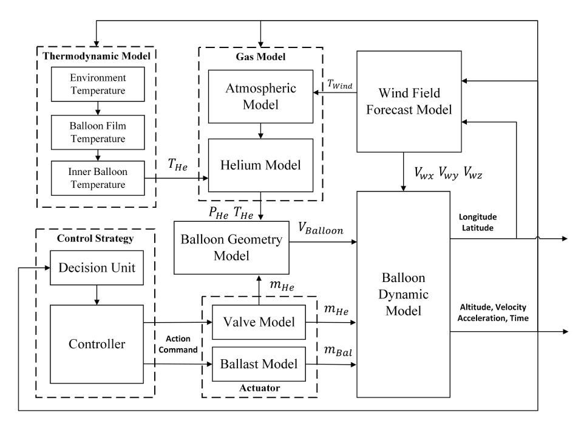
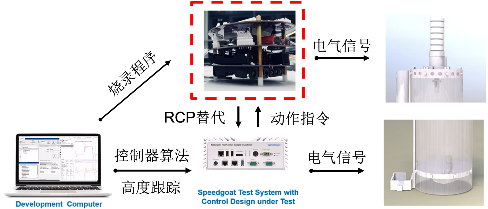
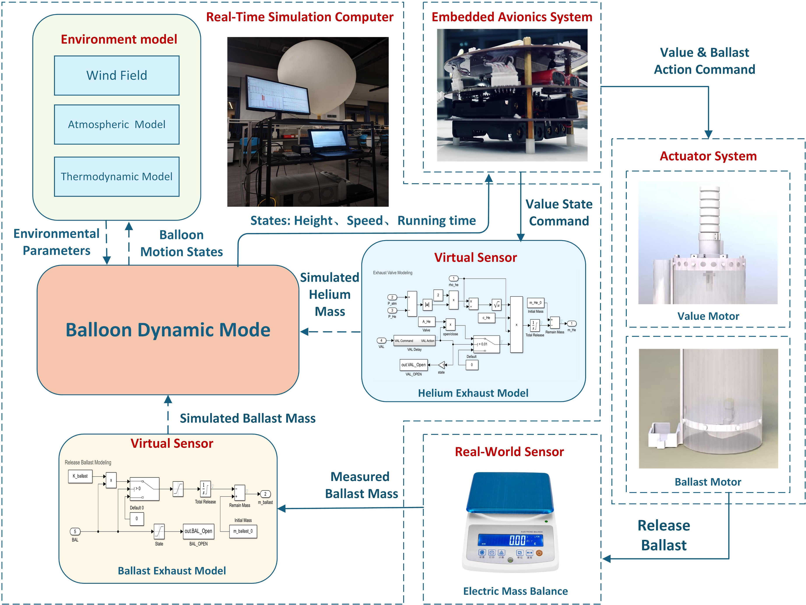

..  文章标题：###### ********
            Part   Chapter  Section  Subsec  Subsub  Para
            ###### ******** ======== ------- ^^^^^^^ """"""""
    行内标记：*斜体* **加粗** ``代码`` 
    上下标： A\ :sup:`上标` B\ :sub:`下标`
    列表：   1. 编号列表 2. 编号列表 #. 自动列表
            * 无序列表 + 无序列表 - 无序列表
    超链接： `链接文本 <http://www.baidu.com>`_
            `声明链接`_
            .. _声明链接: <http://www.baidu.com>
    交叉引用：待补充

#############################
Simulatoin and Testing
#############################

*************
气球仿真环境
*************

Matlab(Simulink)
=================
基于Simulink开发的乳胶气球仿真环境，主要用于气球高度控制算法的开发与后续硬件在环仿真测试的验证。
该仿真环境集成了较为准确的气球动力学模型、大气模型、风场模型和热力学模型，能够模拟气球在不同环境条件下的运动行为。
可以通过输入执行机构的状态参数（如气阀状态、抛物电机转速）来生成气球的高度变化和运动轨迹。
下图为气球仿真环境的框图：

C++
========
用于气球轨迹规划算法的模拟器的核心是用 C++ 编写的，这允许极快的模拟;
在执行直接部署时，它可以在6核计算机上每秒计算数十万个为期三天的ValBal轨迹。
该代码设计为模块化：人们可以很容易地使用不同的目标函数（水平距离、到给定目标的距离）、不同的优化方法（vanilla gradient descent、Adagrad、Adam......）、
各种可微控制器（uniform distribution, approximate Lasagna, differentiable Lasagna......）等等。
仿真代码库的另一个关键功能在设计时考虑了优化，是根据 C++ 模板进行表述，允许编译器从单个代码库生成代码，这些代码要么仅计算轨迹的推出，要么跟踪导致最终目标函数的梯度。
后者使用自动微分，与训练大型神经网络时使用的算法相同。它跟踪每个节点的计算图和导数;计算出最终目标函数（例如，最终经度）后，梯度将向后传播到每个参数，并使用一些一阶优化方法来更新参数。
通过使用 Adept 库，参数化代码库可以专门用于使用 Adept 的可微浮点类型，该类型跟踪计算图。这样做会产生大约 5 到 10倍的开销，但能够提供物镜相对于参数的精确梯度，比直接数值微分要容易得多，并且没有单独的代码路径进行直接计算和梯度计算。

****************
算法部署与测试
****************

快速控制原型
==============
该实验平台的目的是提供一个快速控制原型，主要用于验证气球高度控制算法的有效性和实时性。通过大量的地面仿真测试来调整控制器的参数，以实现最佳的控制效果。
该快速控制原型实验平台可参考下图：

硬件在环测试
==============
该实验平台的目的是提供一个虚拟化的环境，与纯仿真不同的是，需要将控制策略写入嵌入式控制器中，接入真实的执行机构，做Real-time的测试验证。
该硬件在环实验平台由以下几部分组成：

1. 高性能的Real-time machine，用来运行大气模型、风场模型和热力学模型，以计算环境参数供气球动力学模型计算得到气球的运动仿真。
2. 不提供浮力的乳胶气球高度控制平台，用来根据虚拟的实时仿真环境参数数据，取代嵌入式系统的高度传感器和速度传感器，作为输入经过控制算法，输出执行机构电机的PWM波，驱动执行机构工作。
3. 可通讯的质量称，用来反馈实际的抛物质量，直接作用到气球动力学模型。
4. 通讯板卡，该部分的作用为串联Real-time仿真平台与实物的通讯功能，通过IO504扩展板卡，利用电平信号通过RS485协议实现环境参数与执行机构状态及实时压舱物剩余质量的通讯，具体内容见实验平台框图。

